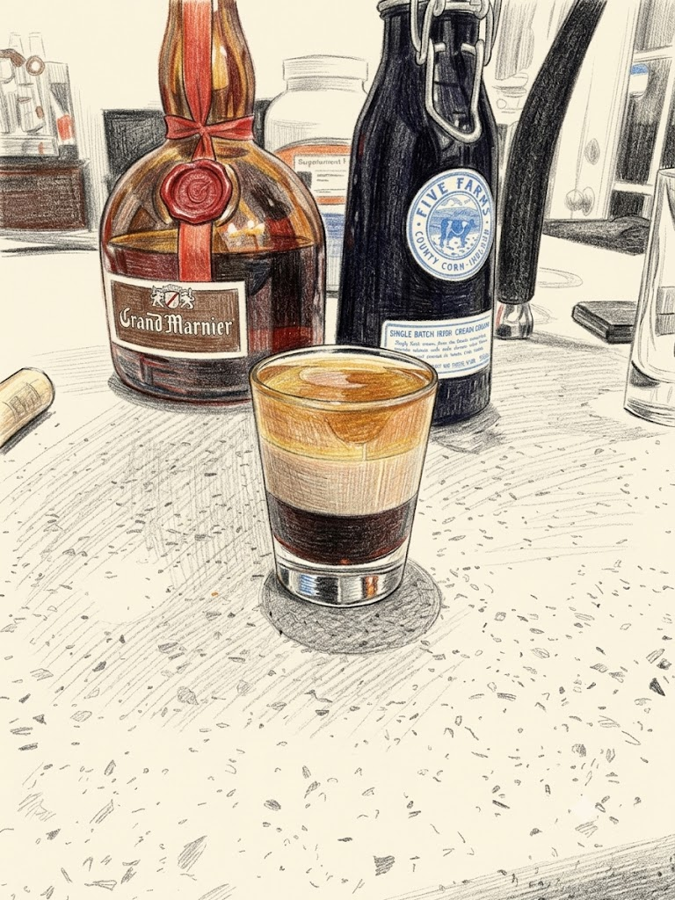

# B-52

**Background:** Invented by Peter Fich at the Banff Springs Hotel in 1977. Contrary to popular belief, it was named after the band The B-52s, rather than the bomber. It is a classic layered shooter known for its distinct three-tier appearance. (source: https://en.wikipedia.org/wiki/B-52_(cocktail))

- **Glassware:** Shot
- **Ingredients:**
  - 1 part Coffee Liqueur (Bottom)
  - 1 part Irish cream (Middle)
  - 1 part Grand Marnier or Triple Sec (Top)
- **Instruction:** Build each ingredient one at a time into a shot glass according the the order above.
- **Garnish:** N/A
- **Profile:** Sweet, creamy, and decadent with notes of coffee, orange, and vanilla.
- **Tags:** #Liqueur #Coffee #Orange #Creamy #Layered #Shot #Classic

**Eric — Rating:** 2 / 5
> N/A

**Charlene — Rating:** _ / 5
> N/A

**Modified Variation:** N/A

**!!Tips:** When layering each ingredients, let the bar spoon touch the glass wall and slowly pouring from the back of the bar spoon.

**Other Similar Cocktails:** TBD
