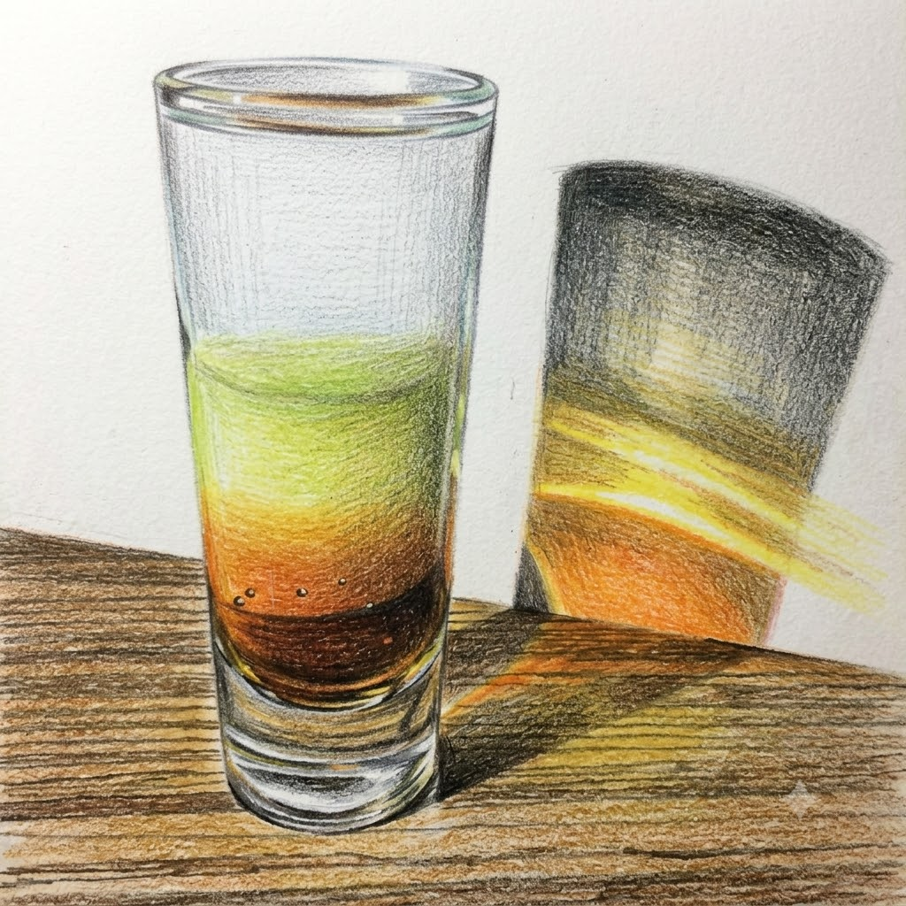

# Bijou (Layered)

**Background:** A layered "pousse-café" adaptation of the classic Bijou cocktail, which first appeared in Harry Johnson's *New and Improved Bartender’s Manual* in the late 1890s. The name (French for "jewel") refers to its components: gin (diamond), sweet vermouth (ruby), and green chartreuse (emerald). (source: https://en.wikipedia.org/wiki/Bijou_(cocktail))

- **Glassware:** Shot
- **Ingredients:**
  - 1 part Green chartreuse (Bottom)
  - 1 part Sweet vermouth (Meddle)
  - 1 part Gin (Top)
- **Instruction:** Build each ingredient one at a time into a shot glass according the the order above. 
- **Garnish:** N/A
- **Profile:** Bold, herbal, and spirit-forward. Layers the ingredients to showcase their colors, offering a complex progression from rich, spiced vermouth to intense herbal Chartreuse and crisp gin.
- **Tags:** #Gin #Vermouth #Boozy #Complex #Herbal #Layered #Shot

**Eric — Rating:** 2 / 5
> N/A

**Charlene — Rating:** _ / 5
> N/A

**Modified Variation:** N/A

**!!Tips:** When layering each ingredients, let the bar spoon touch the glass wall and slowly pouring from the back of the bar spoon.

**Other Similar Cocktails:** TBD
