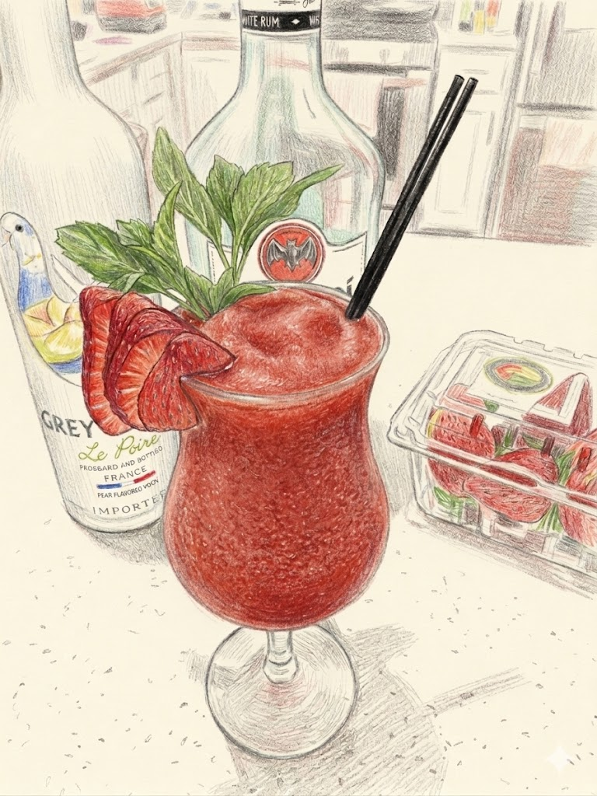

# Daiquiri (Frozen strawberry)

**Background:** A mid-20th-century American evolution of the Cuban classic, combining the 1890s recipe with 1930s Havana blending techniques and the post-war Tiki culture's love for fruit purees. (source: https://www.copenhagendistillery.com/journal/the-history-of-the-daiquiri)

- **Glassware:** Hurricane
- **Ingredients:**
  - 2 oz White rum
  - 1 oz Fresh lime juice
  - 0.75 oz Simple syrup
  - 5-6 strawberries
- **Instruction:** Add all ingredients and ice into a blender. Blend it into smoothie texture and pour into chilled glass.
- **Garnish:** Strawberry slices and Mint sprig.
- **Profile:** Refreshing, Fruity, and Sweet with a smooth slushy texture.
- **Tags:** #Rum #Lime #Strawberry #Refreshing #Fruity #Blended #Sour

**Eric — Rating:** 3.5 / 5
> N/A

**Charlene — Rating:** _ / 5
> N/A

**Modified Variation:** May substitute part of the white rum with pear liqueur for a more complex taste.

**!!Tips:** N/A

**Other Similar Cocktails:** [Daiquiri](./daiquiri.md) (fused 0.611 — same Rum base; same family (Sour); shared lime & sugar; both Refreshing), [Caipirinha](./caipirinha.md) (fused 0.559 — same Rum base; same family (Sour); shared lime & sugar; both Refreshing), [Ti' Punch](./ti-punch.md) (fused 0.47 — same Rum base; shared lime & sugar), [Mojito](./mojito.md) (fused 0.445 — same Rum base; shared lime & sugar; both Refreshing), [Queen's Park Swizzle](./queens-park-swizzle.md) (fused 0.389 — same Rum base; shared lime & sugar)
