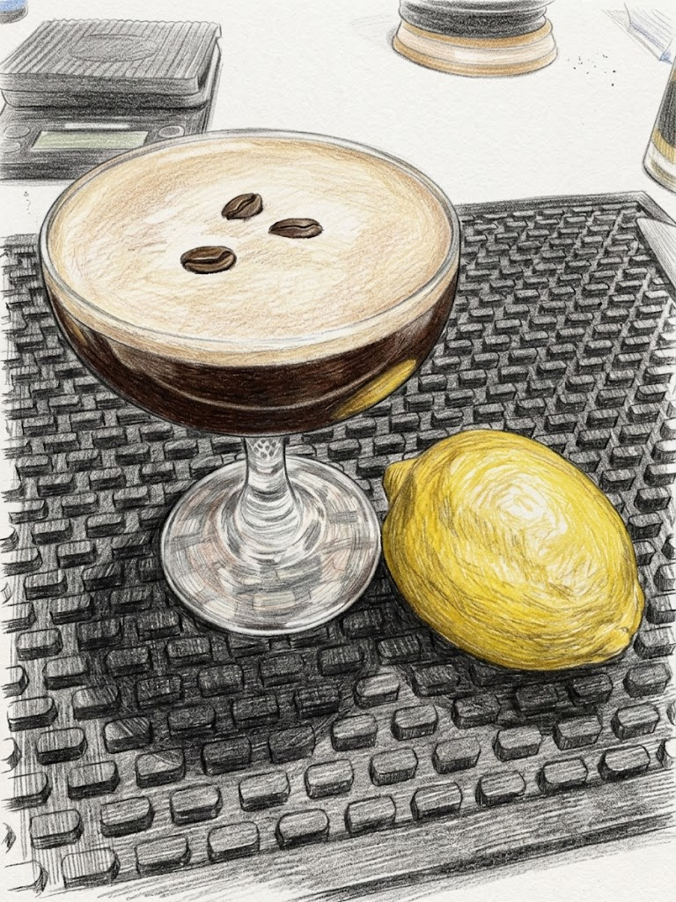

# Espresso Martini

**Background:** Created in 1983 by legendary London bartender Dick Bradsell at the Soho Brasserie, the drink was famously born when a young model asked for something that would "wake me up, and then f*** me up." Originally called the Vodka Espresso (and briefly the Pharmaceutical Stimulant), it was renamed in the 1990s as it gained popularity in V-shaped glasses. (source: https://mclarenvalecellars.com/blogs/blog/the-history-of-the-espresso-martini)

- **Glassware:** Coupe
- **Ingredients:**
  - 1 oz Mr. Black Cold Brew Coffee Liqueur
  - 1 oz Vodka or Cognac
  - 1 oz Freshly brewed espresso (slightly cooled)
  - 0.25 oz Rich Demerara syrup (2:1)
  - 1 swath Lemon oil
- **Instruction:** Add all ingredients to a shaker with ice. Express the oil from a lemon swath into the tin and shake vigorously to create a thick foam. Double strain into a chilled coupe. Express more lemon oil over the top.
- **Garnish:** 3 roasted coffee beans
- **Profile:** Bold and rich from espresso and Demerara, finished with clean lemon oil. Foamy and silky on the palate.
- **Tags:** #Vodka #Coffee #Sugar #Boozy #Complex #Shaken #Coupe

**Eric — Rating:** 4 / 5
> N/A

**Charlene — Rating:** _ / 5
> N/A

**Modified Variation:** N/A

**!!Tips:** Let the espresso cool down a little before making this cocktail to prevent over dilution.

**Other Similar Cocktails:** [Long Island Ice Tea](./long-island-ice-tea.md) (fused 0.40 — same Vodka base; shared lemon & sugar; both Boozy)