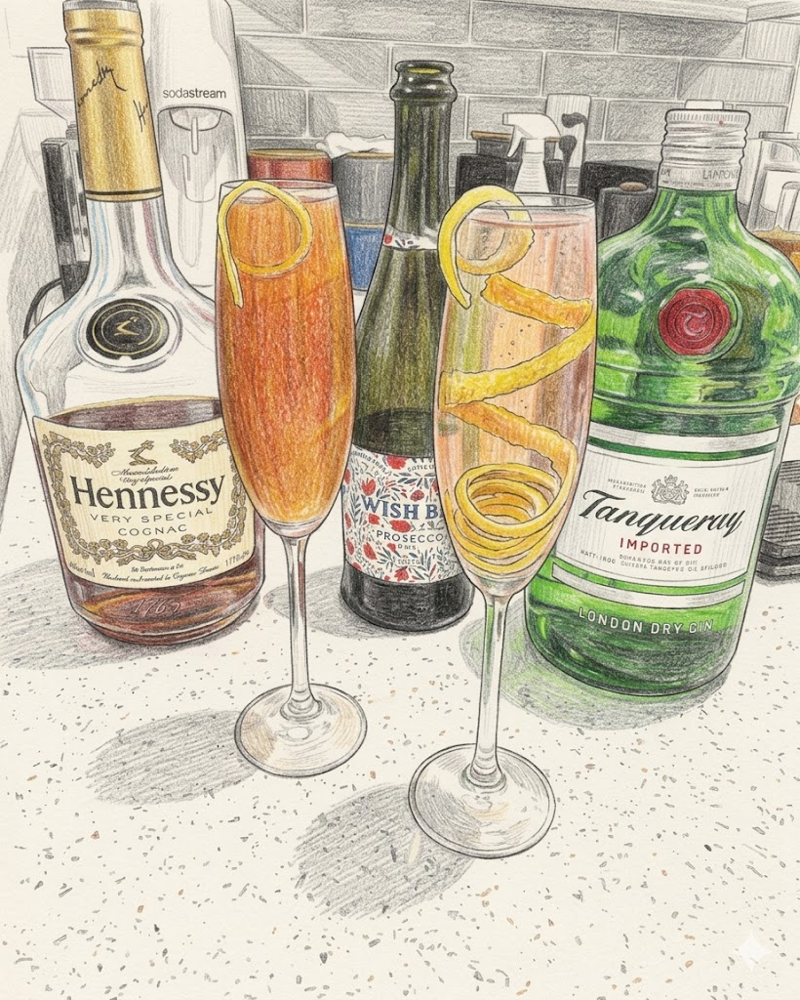

# French 75

**Background:** Named after the French 75mm field gun used in World War I, this cocktail was said to have a "kick" that felt like being hit by the powerful artillery piece. It was popularized at Harry's New York Bar in Paris and is essentially a Tom Collins made with Champagne instead of soda water. (source: https://www.diffordsguide.com/g/1154/french-75-cocktails)

- **Glassware:** Flute
- **Ingredients:**
  - 2 oz Brut sparkling wine
  - 1 oz Gin
  - 1/2 oz fresh lemon juice
  - 1/2 oz simple syrup
- **Instruction:** Pour approx. 2oz of sparkling wine into Champagne flute. Add all remaining ingredients and ice into shaking tin. Shake and strain into the glass. Top up with more sparkling wine and garnish with a lemon twist.
- **Garnish:** Lemon twist
- **Profile:** Bubbly, crisp, and refreshing.
- **Tags:** #Gin #Lemon #Refreshing #Shaken #Fizz #Flute #Wine

**Eric — Rating:** 3.5 / 5
> N/A

**Charlene — Rating:** 3.5 / 5
> N/A

**Modified Variation:** N/A

**!!Tips:** The mixed ingredients are heavier than the sparkling wine. Adding sparkling wine first and adding the rest from top for a better mixing results. 

**Other Similar Cocktails:** TBD
