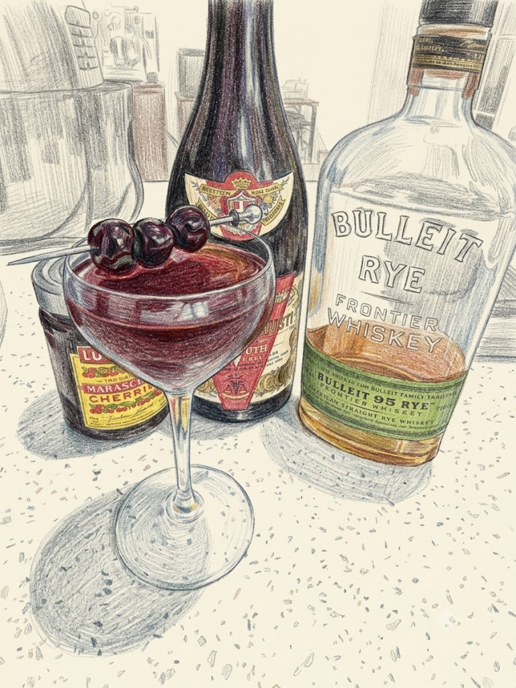

# Manhattan

**Background:** Emerging in the 1860s–1870s in New York City, the Manhattan is a cornerstone of the aromatic cocktail family and often cited as the first modern cocktail due to its use of vermouth. While popular legend attributes it to the Manhattan Club in 1874 for a banquet hosted by Lady Randolph Churchill, it was more likely created by a bartender named Black at the Hoffman House. (source: https://www.diffordsguide.com/g/1151/manhattan-cocktail/history)

- **Glassware:** Nick & Nora
- **Ingredients:**
  - 2 oz Rye Whiskey
  - 1 oz Sweet Vermouth
  - 2 dashes Angostura bitters
- **Instruction:** Add all ingredients into a mixing glass with ice. Stir until well-chilled and strain into a chilled glass.
- **Garnish:** Maraschino cherry
- **Profile:** Boozy, sophisticated, and balanced; a spirit-forward classic where the spicy notes of rye are mellowed by rich sweet vermouth.
- **Tags:** #Whiskey #Vermouth #Angostura #Boozy #Complex #Stirred #Classic

**Eric — Rating:** 4.5 / 5
> N/A

**Charlene — Rating:** 5 / 5
> N/A

**Modified Variation:** N/A

**!!Tips:** A barspoon of syrup from maraschino cherry will add depth and complexity, also give the cocktail more body. HIGHLY RECOMMEND TO USE PREMIUM COCKTAIL CHERRY (e.g. Luxardo). NEVER USE THE ARTIFICIAL/RADIOACTIVE CHERRIES YOU WOULD SEE ON A CAKE.

**Other Similar Cocktails:** [Tipperary](./tipperary.md) (fused 0.58 — same Whiskey base; shared vermouth & bitters; both Classic), [The Lower Wacker](./the-lower-wacker.md) (fused 0.40 — same Whiskey base; shared vermouth & bitters; both Stirred), [Shamrock Cocktail](./shamrock-cocktail.md) (fused 0.37 — same Whiskey base; same Stirred technique; both Classic)
