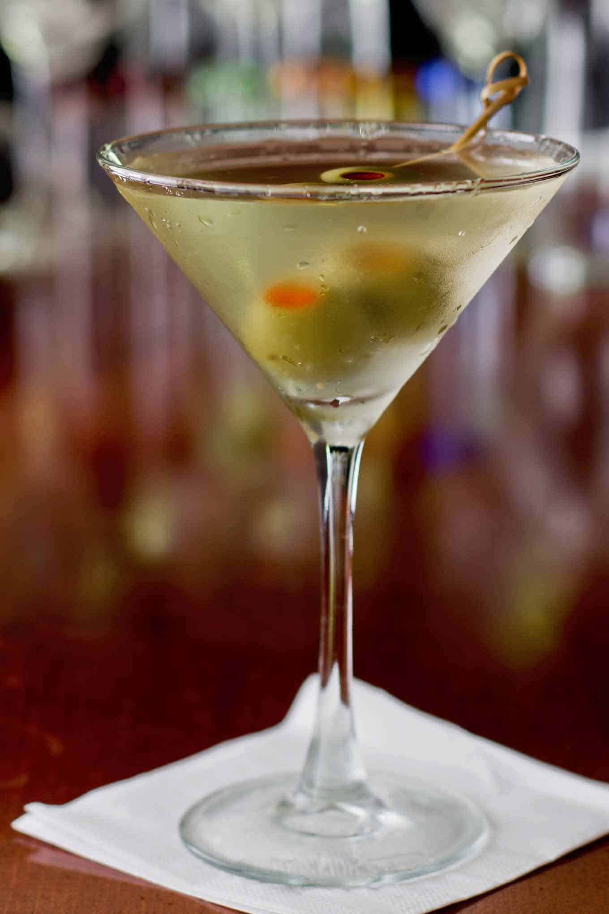

# Martini

**Background:** The Martini's origins are debated, but it likely evolved from the sweeter 19th-century "Martinez." It became dryer in the early 20th century as London Dry Gin and dry French vermouth became preferred. Its status was cemented during Prohibition when gin was easier to produce illegally, and it remains a global symbol of sophisticated drinking. (source: https://alcoholprofessor.com, https://sipsmith.com)

- **Glassware:** Martini glass
- **Ingredients:**
  - 1.5 oz Gin
  - 3/4 oz Dry vermouth
  - 1-2 dashes Regan’s Orange Bitters No. 6
- **Instruction:** Add all ingredients to mixing glass, add ice, and stir until cold. strain into chilled glass and express lemon oil. Add olive for garnishing
- **Garnish:** Lemon oil and olive
- **Profile:** Clean, bright, sharp and herbal.
- **Tags:** #Gin #Vermouth #Dry #Stirred #Martini #MartiniGlass

**Eric — Rating:** 4.5 / 5
> N/A

**Charlene — Rating:** _ / 5
> N/A

**Modified Variation:** N/A

**Other Similar Cocktails:** TBD
