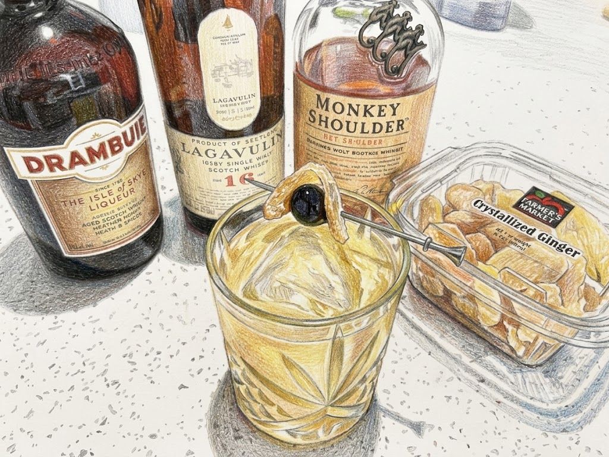

# Penicillin

**Background:** Created by Sam Ross in 2005 at Milk & Honey, NYC. It's a smoky, spicy riff on a Whiskey Sour, named for its medicinal ingredients—honey, lemon, and ginger are classic home remedies for a cold. (source: https://en.wikipedia.org/wiki/Penicillin_(cocktail))

- **Glassware:** Rocks
- **Ingredients:**
  - 2 oz Blended Scotch Whisky
  - 1/4 oz Islay Scotch Whisky
  - 3/4 oz fresh lemon juice
  - 3/4 oz honey syrup (3:1 ratio)
  - 3-4 slices of fresh ginger
- **Instruction:** Add ginger slices into shaking tin, muddle ginger slices well, add all the remaining ingredients to the shaking tin, add ice and shake. Strain into rock glass with a large ice. garnish with candied ginger.
- **Garnish:** Candied ginger
- **Profile:** Smoky, spicy, and citrusy with a rich honey sweetness and a sharp ginger bite.
- **Tags:** #Whiskey #Lemon #Ginger #Honey #Smoky #Spicy #ModernClassic

**Eric — Rating:** 3 / 5
> N/A

**Charlene — Rating:** _ / 5
> N/A

**Modified Variation:** N/A

**!!Tips:** N/A

**Other Similar Cocktails:** [Whiskey Sour](./whiskey-sour.md) (fused 0.436 — same Whiskey base; shared lemon & sugar)
