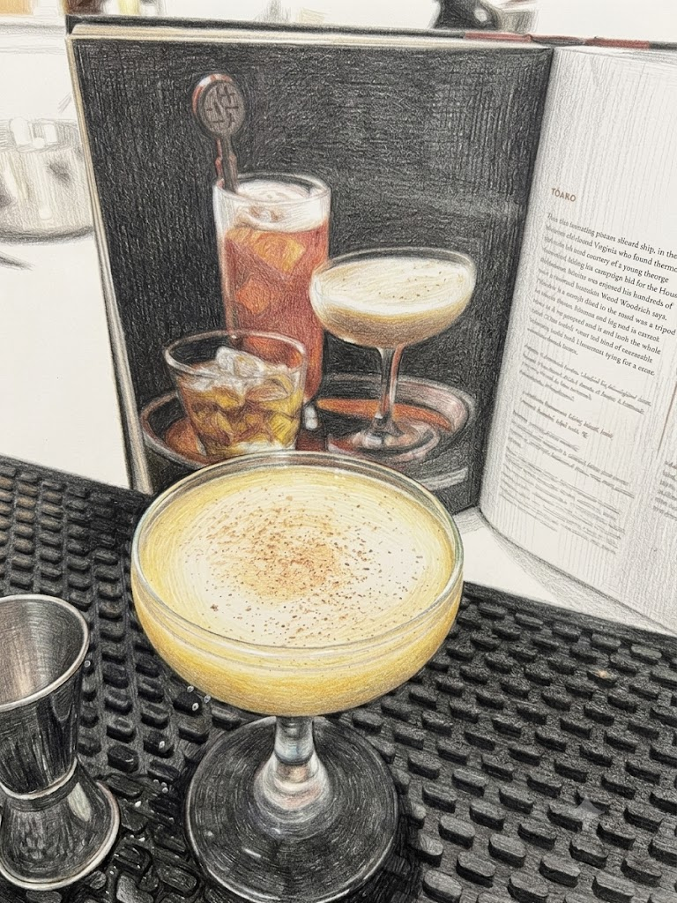

# Rum Flip

**Background:** A historic cocktail dating back to the late 17th century. Originally a warm tavern drink made with beer and rum, it evolved into a cold, individual cocktail shaken with a whole egg in the 19th century. (source: https://www.diffordsguide.com/g/1150/flips)

- **Glassware:** Coupe
- **Ingredients:**
  - 1 medium egg
  - 1/4 oz Demerara syrup
  - 2 oz blended aged rum
- **Instruction:** Add all ingredients to a shaking tin, dry shake vigorously without ice for 10-20 seconds. Add ice and shake to chill. Double strain into chilled glass.
- **Garnish:** Freshly grated nutmeg
- **Profile:** Rich, velvety, and dessert-like with a luxurious mouthfeel and warm spice from freshly grated nutmeg.
- **Tags:** #Rum #Egg #Nutmeg #DryShake #Flip #Coupe #Classic

**Eric — Rating:** 3.5 / 5
> N/A

**Charlene — Rating:** 3 / 5
> N/A

**Modified Variation:** N/A

**!!Tips:** N/A

**Other Similar Cocktails:** [Chicago Fizz](./chicago-fizz.md) (fused 0.45 — same Rum base; shared egg & DryShake technique; both Classic)
