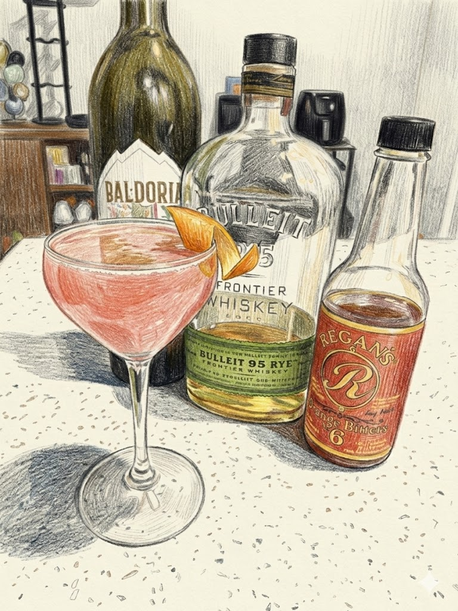

# Scofflaw

**Background:** Created in 1924 at Harry’s New York Bar in Paris. The name "scofflaw" comes from a 1923 contest held by prohibitionist Delcevare King in 1923 to find a word for those who "scoffed at the law" by drinking illegally during Prohibition. (source: https://www.thekitchn.com/classic-cocktail-recipe-the-scofflaw-recipes-from-the-kitchn-185868)

- **Glassware:** Coupe
- **Ingredients:**
  - 1.5 oz Rye Whiskey
  - 1 oz Dry Vermouth
  - 1/2 oz lemon juice
  - 1/4 oz grenadine
  - 2 dashes Regan's Orange Bitters No. 6
- **Instruction:** Add all ingredients and ice into shaking tin. Shake well and pour into chilled glass. express orange oil and garnish with an orange peel.
- **Garnish:** Orange peel
- **Profile:** Tart, spicy, and herbal. A dry sour where the dry vermouth balances the rye and grenadine.
- **Tags:** #Whiskey #Vermouth #Lemon #Citrusy #Tart #Shaken #Classic

**Eric — Rating:** 3 / 5
> N/A

**Charlene — Rating:** _ / 5
> N/A

**Modified Variation:** N/A

**!!Tips:** N/A

**Other Similar Cocktails:** [The Belmont Jewel](./the-belmont-jewel.md) (fused 0.41 — same Whiskey base; shared lemon; both Shaken), [Whiskey Sour](./whiskey-sour.md) (fused 0.41 — same Whiskey base; shared lemon & sugar; same technique Shaken)
