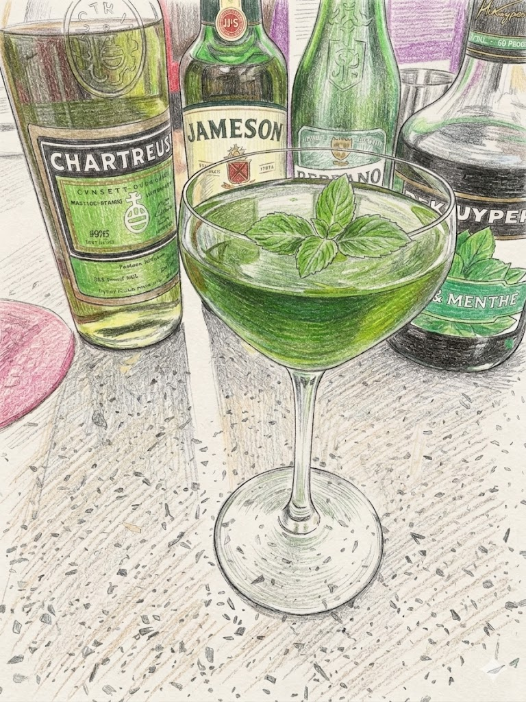

# Shamrock Cocktail

**Background:** The Shamrock is a classic cocktail that dates back to the early 20th century, notably appearing in Hugo Ensslin's *Recipes for Mixed Drinks* (1917) and Harry Craddock's *The Savoy Cocktail Book* (1930). Often described as an "Irish Martini," it is a sophisticated, herbaceous drink that showcases the complexity of Irish whiskey when paired with herbal liqueurs. (source: https://www.diffordsguide.com/cocktails/recipe/1792/shamrock-cocktail)

- **Glassware:** Coupe
- **Ingredients:**
  - 1.5 oz Irish Whiskey
  - 1.5 oz Dry Vermouth
  - 0.25 oz Green Chartreuse
  - 1 bsp Green Crème de Menthe
- **Instruction:** Add all ingredients to a mixing glass filled with ice and stir well for about 30 seconds until thoroughly chilled. Strain into a chilled coupe glass.
- **Garnish:** Mint leaves
- **Profile:** Savory and herbaceous with a cooling mint finish and complex botanical depth.
- **Tags:** #Whiskey #Herbal #Stirred #Martini #Classic #StPatricksDay

**Eric — Rating:** _ / 5
> N/A

**Charlene — Rating:** _ / 5
> N/A

**Modified Variation:** N/A

**!!Tips:** Can replace Dry vermouth with Blanc vermouth for a richer profile.

**Other Similar Cocktails:** [Manhattan](./manhattan.md) (fused 0.37 — same Whiskey base; same Stirred technique; both Classic)
