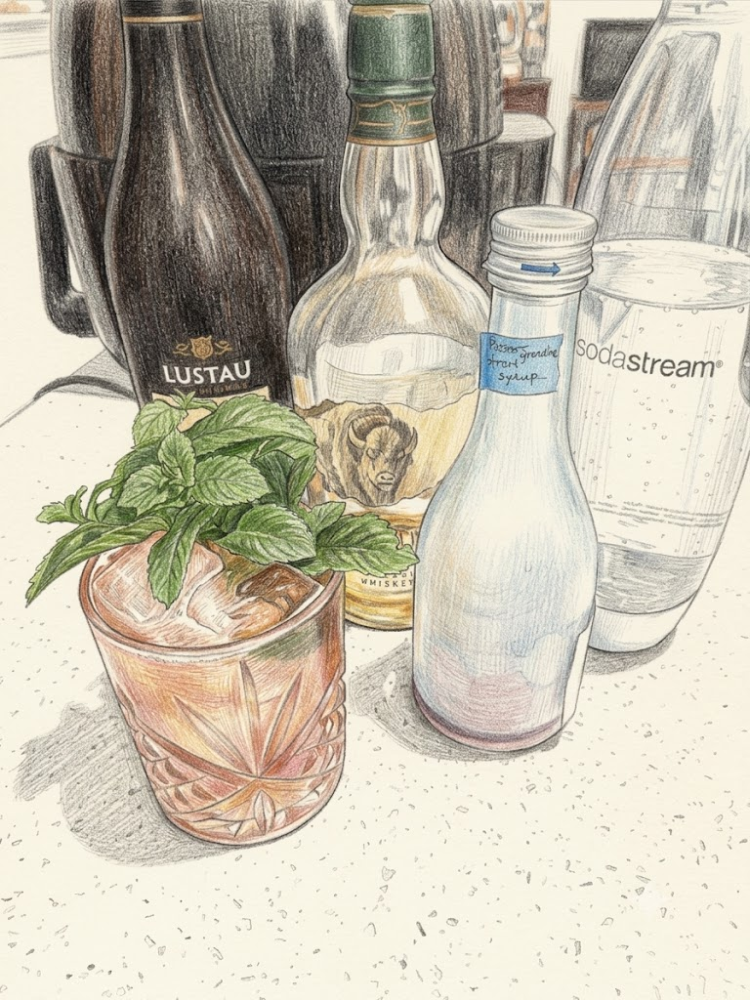

# The Belmont Jewel

**Background:** The Belmont Jewel is the official cocktail of the Belmont Stakes, the final leg of horse racing's Triple Crown. While the official modern track version is a simple mix of bourbon, lemonade, and pomegranate juice, this recipe is a premium variation drawing on Dale DeGroff's 1998 Belmont Breeze recipe. It adds Oloroso sherry and grenadine for depth and is topped with sparkling water for an effervescent finish. (source: https://www.washingtonpost.com/archive/food/1998/05/20/at-belmont-stakes-a-new-breeze/3e0fec7d-f42f-48d6-95cb-648c0812de83/)

- **Glassware:** Rocks
- **Ingredients:**
  - 1.5 oz Bourbon whiskey
  - 3/4 oz fresh lemon juice
  - 1/2 oz grenadine
  - 1/2 oz Lustau Oloroso Don Nuño Sherry
  - 2-3 oz sparkling Water
- **Instruction:** Add all ingredients except for sparkling water into a shaking tin with ice. Shake vigorously to chill. Strain into a rocks glass filled with fresh ice while simultaneously pouring the sparkling water. Garnish with mint sprigs.
- **Garnish:** Mint sprigs
- **Profile:** Tart, fruity, and refreshing
- **Tags:** #Whiskey #Lemon #Mint #Refreshing #Fruity #Shaken #Highball

**Eric — Rating:** 3 / 5
> Make sure do not over dilute the drink. Can easily go bland when overdiluted.

**Charlene — Rating:** _ / 5
> N/A

**Modified Variation:** N/A

**!!Tips:** N/A

**Other Similar Cocktails:** [Scofflaw](./scofflaw.md) (fused 0.41 — same Whiskey base; shared lemon; both Shaken), [Whiskey Sour](./whiskey-sour.md) (fused 0.40 — same Whiskey base; shared lemon & sugar; both Shaken)
