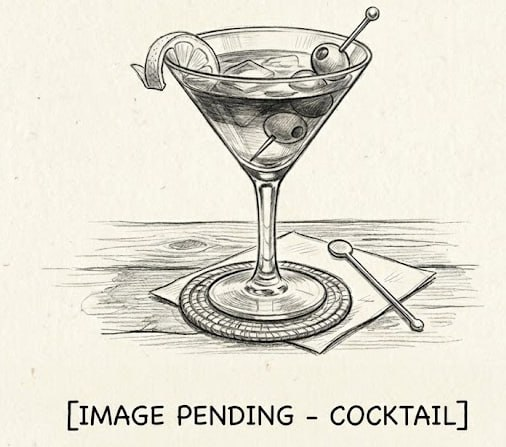

# Ti' Punch

**Background:** The Ti' Punch (short for "petit punch," or "little punch") is the national aperitif of Martinique, the French Caribbean island famed for its rhum agricole — rum distilled directly from fresh sugarcane juice rather than molasses, producing a grassy, funky spirit unlike any other. The drink's three ingredients — rhum, cane syrup, and a pressed coin of lime — are intentionally minimal: the quality of the rhum agricole is the point. Martiniquais tradition holds that each guest prepares their own Ti' Punch, a custom captured in the saying "chacun prépare sa propre mort" ("each prepares their own death"). (source: https://en.wikipedia.org/wiki/Ti%27_punch)

- **Glassware:** Rocks
- **Ingredients:**
  - 1 barspoon (~5 ml) cane sugar syrup or simple syrup
  - 1 coin of lime peel with a small bit of flesh
  - 2 oz Rhum Agricole
- **Instruction:** Add syrup to a chilled glass. Squeeze the lime coin to express a small amount of juice and oil, then drop the peel into the glass. Add Rhum Agricole and stir well.
- **Garnish:** Lime peel (already in the drink)
- **Profile:** Grassy and funky from the rhum agricole, lightly sweetened by cane syrup, with a bright citrus note from the expressed lime oil. Potent and intentionally spirit-forward.
- **Tags:** #Rum #Lime #Sugar #Citrusy #Boozy #Rocks #Classic

**Eric — Rating:** _ / 5
> N/A

**Charlene — Rating:** _ / 5
> N/A

**Modified Variation:** N/A

**!!Tips:** N/A

**Other Similar Cocktails:** [Daiquiri (Frozen strawberry)](./daiquiri-frozen-strawberry.md) (fused 0.47 — same Rum base; shared lime & sugar), [Caipirinha](./caipirinha.md) (fused 0.44 — same Rum base; shared lime & sugar; both Classic), [Mojito](./mojito.md) (fused 0.43 — same Rum base; shared lime & sugar), [Daiquiri](./daiquiri.md) (fused 0.43 — same Rum base; shared lime & sugar), [Queen's Park Swizzle](./queens-park-swizzle.md) (fused 0.42 — same Rum base; shared lime & sugar), [Rum Flip](./rum-flip.md) (fused 0.38 — same Rum base; shared sugar; both Classic)
