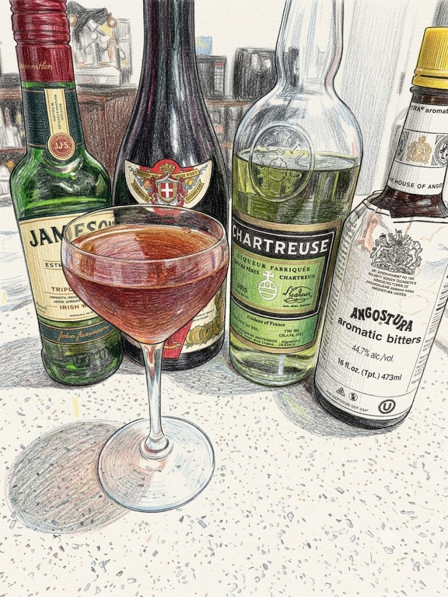

# Tipperary

**Background:** The Tipperary is a classic Irish whiskey cocktail first published in Hugo Ensslin's 1916 *Recipes for Mixed Drinks*. The cocktail's name was inspired by the popular World War I-era British soldiers' anthem, "It's a Long Way to Tipperary." It is structurally similar to the gin-based Bijou cocktail, substituting Irish whiskey to produce a rich, herbaceous, and spirit-forward profile. (source: https://www.cigaraficionado.com/article/the-tipperary-cocktail)

- **Glassware:** Coupe
- **Ingredients:**
  - 2 oz Irish Whiskey
  - 1/2 oz Sweet vermouth
  - 1/4 oz Green Chartreuse
  - 2 dashes Angostura Aromatic Bitters
- **Instruction:** Add all ingredients to a mixing glass filled with ice. Stir until well-chilled and diluted, then strain into a chilled coupe glass. Express lemon oil over the drink.
- **Garnish:** Express lemon oil
- **Profile:** Herbal, boozy, and complex
- **Tags:** #Whiskey #Vermouth #Angostura #Herbal #Complex #Stirred #Classic

**Eric — Rating:** 4 / 5
> Kinda like a variation of Manhattan but you would notice the iconic Chartreuse well merged. Entire drink is rich, rounded and mellow. Irish whiskey gives more soft palate compare to rye used in a classic Manhattan.

**Charlene — Rating:** _ / 5
> N/A

**Modified Variation:** N/A

**!!Tips:** If under diluted, it may result in a disjointed flavor profile.

**Other Similar Cocktails:** [Manhattan](./manhattan.md) (fused 0.58 — same Whiskey base; shared vermouth & bitters; both Classic), [Shamrock Cocktail](./shamrock-cocktail.md) (fused 0.57 — same Whiskey base; shared vermouth & Chartreuse; both Stirred)
