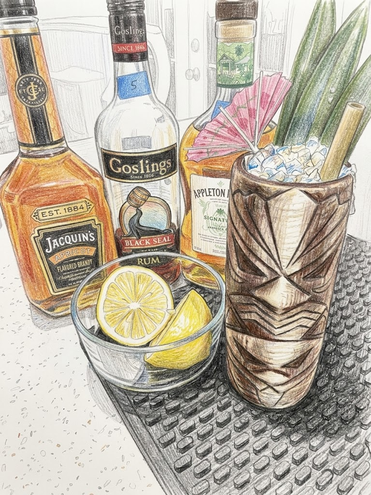

# Tradewinds

**Background:** A classic Tiki cocktail from the 1970s, likely originating in Jamaica at the Hotel Americana. It was later documented and revived by Tiki historian Jeff "Beachbum" Berry in *Beachbum Berry Remixed*. (source: https://monkeybrad.com/the-tradewinds/)

- **Glassware:** TikiMug
- **Ingredients:**
  - 1 oz Lemon juice
  - 1.5 oz Coconut cream
  - 1 oz Apricot liqueur
  - 1 oz Black blended rum
  - 1 oz Blended lightly aged rum
- **Instruction:** Add all ingredients to a shaking tin, add crushed ice and a couple cube ices as agitator. briefly shake and open pour into the mug. garnish the cocktail with the umbrella inside out.
- **Garnish:** Cocktail umbrella, lemon wedge, pineapple frond (optional)
- **Profile:** Sweet-tart and tropical. Features a creamy, lush body from coconut cream balanced by bright lemon and stone-fruit depth from apricot.
- **Tags:** #Rum #Lemon #Coconut #Refreshing #Creamy #Blended #Tiki

**Eric — Rating:** _ / 5
> N/A

**Charlene — Rating:** _ / 5
> N/A

**Modified Variation:** May replace rum with London dry gin for different variation.

**!!Tips:** N/A

**Other Similar Cocktails:** [Bermuda Rum Swizzle](./bermuda-rum-swizzle.md) (fused 0.332 — same Rum base; same Tiki family; shared lemon)
